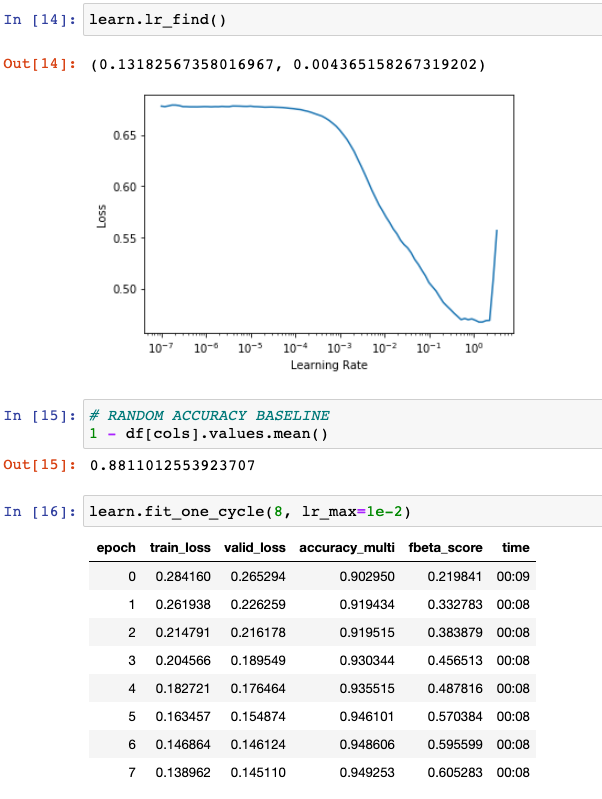

# Physionet2020

### Data
Download here: https://storage.cloud.google.com/physionet-challenge-2020-12-lead-ecg-public/PhysioNetChallenge2020_Training_CPSC.tar.gz  
If you are on USF3, location is /mnt/data1/wamri/physionet2020

### Installation
* clone project, cd physionet2020

* create conda environment
`conda env create -f environment.yml`
`conda activate physionet2020`

### Running the project

1. First run through notebook 01_preprocess.ipynb to process data.

Or you can download preprocessed data here: https://drive.google.com/file/d/1ve_Jh57QSvmTeEf3AfCIZ4fTYpwL79ad/view?usp=sharing

2. 02_train is a quick and dirty example on how to train a model with fastai

